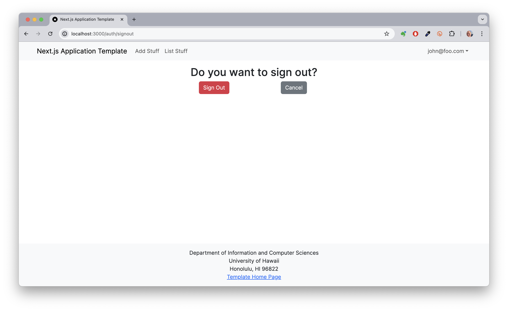

# Digits: A Contact Management System


Digits is an application that allows users to:

* Register an account.
* Create and manage a set of contacts.
* Add contact information including name, address, image and description.
* Control access to contact data with admin and regular user roles.

## Installation

### Prerequisites

- Node.js (version 18 or later)
- Git

### Setup Steps

1. Clone the repository:
   ```
   git clone https://github.com/ChristianLow428/Digits.git
   cd Digits
   ```

2. Install dependencies:
   ```
   npm install
   ```

3. Copy the sample environment file and configure it:
   ```
   cp sample.env .env
   ```

4. Set up the database:
   ```
   npx prisma migrate dev --name init
   npx prisma db seed
   ```

5. Start the development server:
   ```
   npm run dev
   ```

The first time you run the app, it will create some default users and data. Here is the expected output:

```
> nextjs-application-template-1@0.1.0 dev
> next dev

  ▲ Next.js 14.2.24
  - Local:        http://localhost:3000
  - Environments: .env

 ✓ Starting...
 ✓ Ready in 1162ms

Environment variables loaded from .env
Running seed command `ts-node --compiler-options {"module":"CommonJS"} prisma/seed.ts` ...
Seeding the database
  Creating user: admin@foo.com with role: ADMIN
  Creating user: john@foo.com with role: USER

🌱  The seed command has been executed.
```

6. Navigate to [http://localhost:3000](http://localhost:3000) to view the application.

You can login using the credentials in settings.development.json, or else register a new account:
- Regular user: email `john@foo.com`, password `changeme`
- Admin user: email `admin@foo.com`, password `changeme`

## User Interface Walkthrough

### Landing Page


When you first bring up the application, you will see the landing page that provides a brief introduction to the capabilities of Digits.

### Register


If you do not yet have an account on the system, you can register by clicking on "Login", then "Sign Up".

### Sign in


Click on the Login link, then click on the Signin link to bring up the Sign In page which allows you to login.

### List Contacts Page


After logging in, users can view a list of their contacts. This page displays all contacts that belong to the current user.

### Add Contact Page


Clicking on the Add Contact link brings up a page that allows you to add a new contact with fields for first name, last name, address, image URL, and description.

### Admin Page


It is possible to designate one or more users as "Admins" through the settings file. When a user has the Admin role, they get access to a special NavBar link that retrieves a page listing all Contacts associated with all users.

### Change Password Page


Users can change their password through this page. Access it by clicking on your email in the navigation bar and selecting "Change Password."

### Sign Out Page



Users can sign out of the application, which will redirect them to the landing page.

## Development Tools

You can verify that the code obeys our coding standards by running ESLint over the code with:

```
npm run lint
```

## Credits

This application was created as a learning project based on the [Next.js Application Template](https://github.com/ics-software-engineering/nextjs-application-template).
